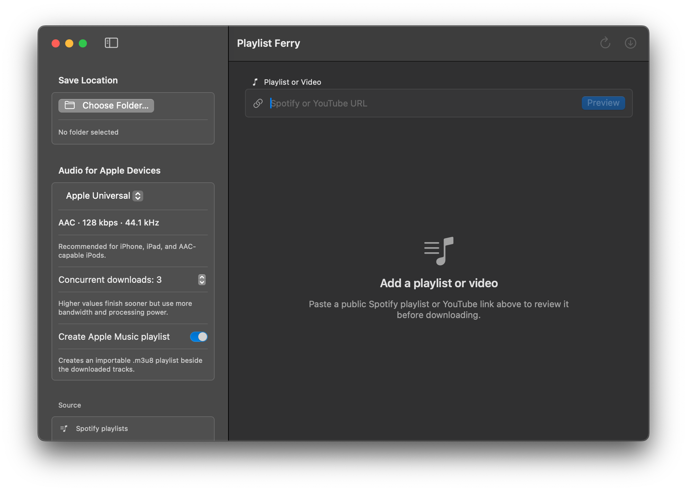
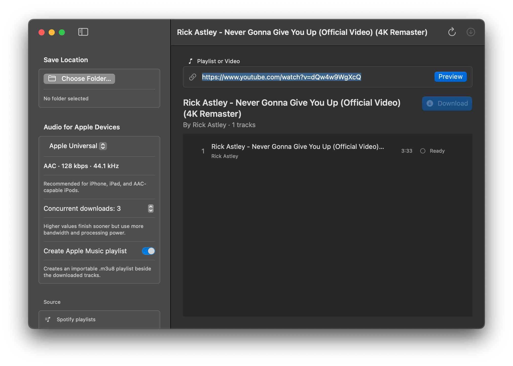

# Playlist Ferry for macOS

A SwiftUI app and Python worker for previewing public Spotify playlists, YouTube playlists, and individual YouTube videos. Spotify tracks are matched to audio through spotDL; YouTube sources download their exact linked videos. It offers Apple device audio presets, track status, destination selection, and cancellation.

Version 2.0.0 adds direct YouTube videos and playlists, Apple Music-compatible playlist exports, configurable concurrent downloads, and per-track manual YouTube repair. Release bundles include Python, FFmpeg, FFprobe, and Deno and are tested on Intel and Apple Silicon. They are ad hoc signed, so macOS may require manual approval in Privacy & Security.

Project documentation lives in the [Wiki](https://github.com/ThatOneGuyGreggers/playlist-ferry/wiki), including [build instructions](https://github.com/ThatOneGuyGreggers/playlist-ferry/wiki/BUILDING), the [development plan](https://github.com/ThatOneGuyGreggers/playlist-ferry/wiki/MACOS_APP_PLAN), [changelog](https://github.com/ThatOneGuyGreggers/playlist-ferry/wiki/CHANGELOG), and [code review](https://github.com/ThatOneGuyGreggers/playlist-ferry/wiki/CODE_REVIEW).

## App overview

The sidebar contains the settings applied when a download starts:

- **Choose Folder…** selects the destination for downloaded audio and any generated playlist. The path appears below the button. A destination is required before **Download** or **Re-download** becomes available.
- **Audio preset** selects one of four device-oriented formats:
  - **Apple Universal** creates 128 kbps AAC `.m4a` files at 44.1 kHz. This is the recommended default for iPhone, iPad, and AAC-capable iPods.
  - **iPhone & iPad High Quality** creates 256 kbps AAC `.m4a` files at 44.1 kHz. Files are larger, and conversion cannot restore quality absent from the YouTube source.
  - **iPod Legacy AAC** creates 128 kbps AAC `.m4a` files at 44.1 kHz using conservative settings for compatible iPods.
  - **Older iPod MP3** creates 128 kbps `.mp3` files at 44.1 kHz for early or MP3-focused iPod libraries.
- **Concurrent downloads** allows 1–8 tracks to download and convert at once; the default is 3. Higher values may finish sooner but use more network bandwidth, CPU, memory, and temporary disk space.
- **Create Apple Music playlist** writes an ordered UTF-8 `.m3u8` file beside the downloaded tracks. Turn it off to download audio without creating the playlist file.
- **Source** identifies the supported inputs: public Spotify playlists, YouTube playlists, and direct YouTube video, Shorts, or Live links.

The main area controls the job:

- **Spotify or YouTube URL** accepts a supported public link.
- **Preview** loads metadata and displays the tracks without downloading audio. Pressing Return in the URL field or Command-Return performs the same action.
- **Refresh Playlist** in the toolbar reloads the current link.
- **Download** downloads every displayed track using the selected destination, preset, concurrency, and playlist setting. It remains disabled until a preview has loaded and a destination folder is selected. Command-D is its keyboard shortcut.
- **Cancel** appears while loading or downloading and stops the active worker operation. Escape also cancels.

## Preview and track controls

After a successful preview, the app shows the source title, author, track count, and an ordered track list. Each row includes the track name, artist, duration, and current status:

- **Ready** means the track is waiting to download.
- **Downloading** means matching, downloading, or conversion is in progress.
- **Saved** means the output file was written successfully.
- **Failed** includes a short error and reveals a **Direct YouTube URL** field. Paste the exact replacement video and choose **Re-download** to retry only that track. A successful retry updates the existing Apple Music playlist in source order instead of processing the full list again.

## References and acknowledgments

- [spotDL / spotify-downloader](https://github.com/spotdl/spotify-downloader), by the spotDL developers, provides playlist metadata, audio matching, downloading, and metadata embedding. The `spotify-downloader` submodule pins commit `cd4a4203f5b12bd6dbbdf22d7674807858d35e05`. Its source retains the upstream [MIT license and copyright notice](spotify-downloader/LICENSE). This app is an independent project and is not an official spotDL release.
- [Apple Human Interface Guidelines summary](https://gist.github.com/eonist/f4ba31012815731284d867232f6c70e4), by eonist, informed the native interface design. It is a community summary; [Apple's Human Interface Guidelines](https://developer.apple.com/design/human-interface-guidelines) are the primary design reference. The [UI design guidance](https://github.com/ThatOneGuyGreggers/playlist-ferry/wiki/UI_DESIGN) records how these principles apply to this app.

These references credit the software dependency and design guidance; they do not imply endorsement. This project's original app code uses the [MIT license](LICENSE). Third-party software retains its own license and copyright notices.
